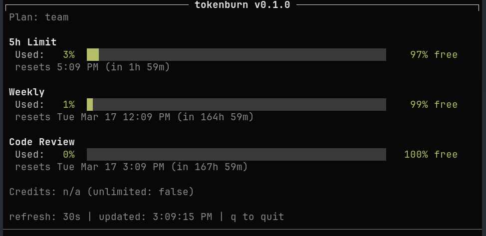

# tokentop

[](https://github.com/lwlee2608/tokentop/actions/workflows/ci.yml)

A terminal dashboard for monitoring your [OpenAI Codex](https://chatgpt.com/codex) usage limits in real time.



## Install

```sh
git clone https://github.com/lwlee2608/tokentop.git
cd tokentop
make install
```

This installs the binary to `~/.local/bin/tokentop`.

## Prerequisites

You need an active Codex session with auth credentials at `~/.codex/auth.json` (created automatically when you use [Codex CLI](https://github.com/openai/codex)).

## License

MIT
